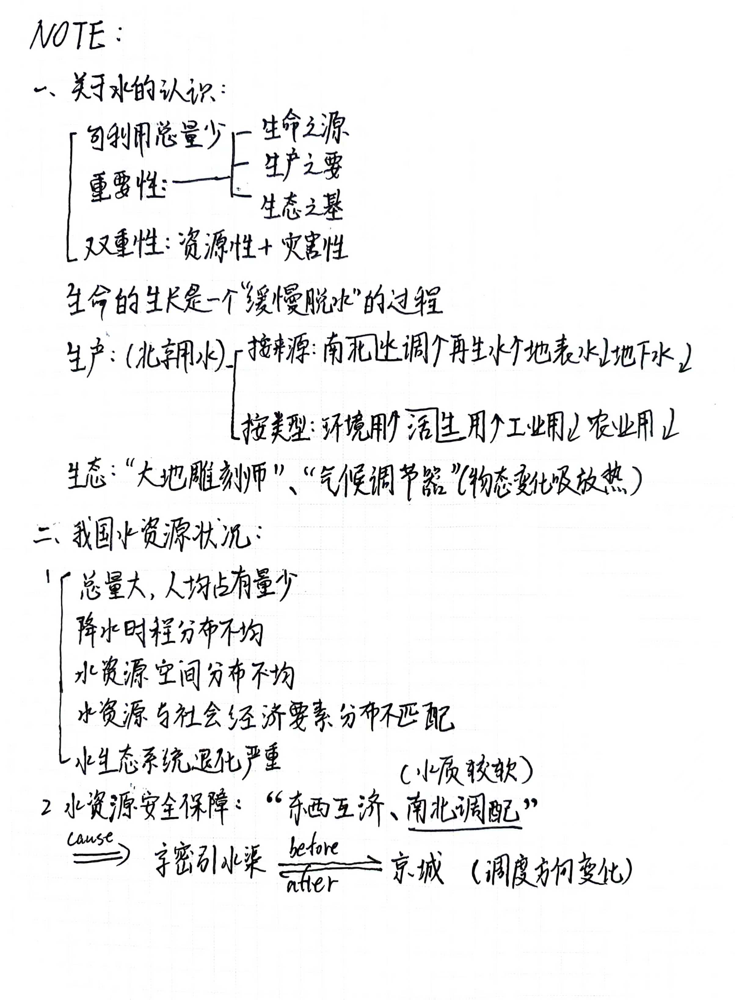

# *基于人工智能AI青藏高原径流预测*

## **课题选择**

      我国西南河流源区生态环境较为脆弱，开展该类地区水循环与水资源对气候变化和人类活动的响应研究具有十分重要的现实意义，将为防灾减灾、水资源可持续利用以及生态安全提供基础理论和科技支撑。青藏高原是亚洲地区十条主要河流重要的发源地，被称为“亚洲水塔”。自20世纪80年代中期以来，青藏高原的气候发生了显著的变化，表现在变暖变湿、风速减弱、太阳辐射减少，导致该地区的水循环发生了剧烈的变化，干旱区变湿，湿润区变干，蒸发增强。青藏高原地表水循环最为突出的基本特征就是冰冻圈、水圈以及大气圈之间的相互作用、相互影响。在气候变暖的背景下，由于冰冻圈对气候变化的敏感性，该地区地表环境发生了一系列深刻的变化，冰川退缩、湖泊扩张、冻土活动层加深、草场退化，等等，这些变化影响到水文循环，威胁到生态系统安全。雅鲁藏布江（以下简称雅江）流域是西藏自治区经济开发潜力最大的核心地区，也是我国最大的跨境国际河流之一，其水资源蕴藏量丰富，生态安全问题也十分突出。近年来，雅江流域冰川退缩、土地沙漠化加剧、降水减少、汛期径流增大，易引起洪涝灾害发生。另外，国际上对雅江跨境水资源和生态环境变化极为关注。与西藏紧邻的印度是全球经济增长最快和人口最多的国家之一，一直关注中国境内雅江流域的水资源利用和生态变化问题。在中印边界问题谈判过程中，跨境水资源、水环境与水生态安全问题已成为印方极为关注的焦点之一。多年来，国家投入了大量的人力、物力和财力，对青藏高原的形成与演变、地质、古环境开展了大量基础研究，取得了若干重大科学进展，但对雅江流域的河流系统变化，特别是水循环变化、气候变化背景下的流域径流响应研究相对比较少。应对全球变化和国际河流可持续发展趋势，迫切需要研究雅江流域水循环演变规律与气候-水文-生态系统相互作用机理问题，为国家解决区域国际重大资源环境问题提供科技支撑和决策依据。

 **文献来源：**
   《雅鲁藏布江流域径流演变与生态水文过程模拟》

## **选题目的**
**青藏高原需得到重视**

 -   青藏高原广泛分布有冰雪、湖泊、多年冻土和季节冻土。在全球变暖背景下，由于冰冻圈对温度变 化异常敏感，青藏高原地表环境已经发生了深刻的变化，表现为雪线上升、冰川退缩、冻土退化以 及湖泊面积急剧变化。1961—2006年，中国年平均冰川融水径流量为 62．3 km3，2001—2006年平均值则为 79．4 km3 ，青藏高原由于多年冻土退化每 年释放的水量达 5 ～ 11 km3 ，冰川和冻土的变化已引起了高原水资源时空分布和水循环过程的变化。 冰川退缩同时引发下游湖泊扩张，并淹没了周边草 场，使得草甸和沼泽湿地面积减少，威胁到生态系统。高原地表环境的深刻变化给我国西北干旱区绿洲经济的长期发展带来了很大的不确定性。
 -   青藏高原素有“中华水塔”之称。研究青藏高原对于保护青藏高原生物多样性、调节我国西北部地区气候、保持流域水源涵养能力、维护高原生态平衡起到了不可替代的作用。

**进行径流预测的必要性**

- 水资源作为生态系统的重要组成部分，是人类活动和社会发展必不可少的自然资源，也是维持生态系统功能稳定的重要资源。在我国经济快速发展的同时，带来了一系列的水环境问题，例如水质恶化、水土流失等。加之人们对生态系统的改造，使水资源在应对气候变化与人类生活的双重影响下，变得更加脆弱。目前，随着全球人口的快速增长、水力发电及农业灌溉的发展致使用水量快速增加，进一步加深水资源供需矛盾。此外，由工业、农业、生活等引起的水资源污染问题将严重影响水环境的安全，最终将减弱生态系统服务能力。

- 准确可靠的径流模拟对洪水预警以及水资源 有效管理有着重要的意义。高寒山区水资源变化直接影响到河川径流乃至全球尺度水循环、水资源及水平衡。
  
**使用AI的优势**

- 人工智能技术具有自主学习、自动推理、智能判断等特点，可以有效地解决传统生态监测和评估方法中存在的采样方法的局限性、数据收集的不连续性、数据处理和分析的不足等问题。例如，利用人工智能技术对大量数据进行分析和处理，可以更加准确地识别和预测生态环境中的问题，发现环境变化趋势，制定科学的生态保护措施。此外，人工智能技术还可以实现对生态环境的实时监测和管理，以及对生态资源的智能利用和分配，从而有效保护生态环境和促进可持续发展。
  
**利用AI的深度学习方法**

- Zhang等(2021)提出了双机器学习方法用于卫星降水融合,并在全国范围内, 比较了四种机器学习方法(随机森林、人工神经网络、支持向量机、极限学习机)、四种双机器学习方法(上述四种方法与随机森林法耦合)以及三种线性权重法(逆误差方差加权、优化权重平均、异常剔除平均)的融合效果,结果表明双机器学习方法能够提升卫星降水质量.
- 在一定程度上提供更加精确的降水描述能够反映更加精细的降水时空分布特征,用于数据融合能够得到更好的结果。从方法来看, 由于降水是一个在时空上连续的过程, 相比于机器学习方法来说,可以考虑降水的空间局部相关性,对于区域内降水的空间分布格局能够进行更好的模拟与再现。
- 深度学习方法相比于经典统计方法和机器学习方法来说,可以考虑降水的空间局 部相关性以及输入变量间的潜在联系,对于区域内降水的空间分布格局能够进行更好的模拟与再现。
- 深度学习能提升ERRIS统计误差模型对径流的校正能力，从而提高流域径流预报的精度，为洪水预报预警和防洪调度提供更有力的科学数据支撑。
  
**文献来源：**
     《青藏高原水文模拟的现状及未来》《青藏高原典型流域生态系统产水量模拟及影响因素分析——以青海湖流域及黄河源区为例》《青藏高原典型流域生态系统产水量模拟及影响因素分析——以青海湖流域及黄河源区为例》《基于LSTM和气候要素分带的金沙江上游流域径流模拟研究》《基于深度学习的青藏高原多源降水融合》《人工智能在三江源地区生态监测的研究与应用》《基于深度学习的改进ERRIS径流预报实时校正方法研究》

## **团队构成**

团队名称：**第③极之 Code Masters 小队**

团队宣言：**Explore to find the right**

指导教师：
**彭定志**教授、
**罗群**老师、
**龚雨薇**老师、
**樊正龙**老师

团队成员及分工（按姓氏首字母排列）：

**段永琪**：pycharm功能和工作介绍及python成果展示

**高博文**：资料查询

**刘牧城**：提供视频素材

**刘政遥**：github功能和工作介绍

**龙澍**：笔记整理

**张洛采**：网页制作

## **研究过程**

### **笔记**

  

***四、Python语法***

**1**  Python中的数据类型

Python提供了多种内置数据类型，此外还有一些通过第三方库提供的复合数据类型。以下是一些常用的数据类型：

- 基本数据类型

•整数(int)：表示整数，例如1,2,3。

•浮点数(foat)：表示小数，例如1.0,2.5,3.14。

•字符串(str)：表示文本，例如"hello","world"。

•布尔值(bool)：表示真(True)或假(False)。

- 集合数据类型

•列表(list)：有序的可变集合，例如[1,2,3]。

•元组(tuple)：有序的不可变集合，例如(1,2,3)。

•集合(set)：无序的独特元素集合，例如{1,2,3}。

•字典(dict)：键值对的集合，例如{"a":1,"b":2}。 

- 复合型数据类型
  
这些数据类型通常需要使用第三方库来实现。

•数组(array) 由numpy库提供，用于处理数值型数据的多维数组。 

Import  numpy  as  np 

arr = np.array([1,2,3])

print(arr)#输出：[123]

•张量(tensor) 由torch库提供，用于深度学习中的多维数组。

Import	torch 

tensor=torch.tensor([1,2,3])

print(tensor)#输出：tensor([1,2,3])

**2**  类的定义

类是面向对象编程的核心概念。它们允许我们创建自定义数据类型，包含属性（变量）和方法（函数）。 

**3**  函数的定义

函数是组织代码的基本单元，用于执行特定任务。以下是一个简单的函数定义示例：

def  greet(name): 

      return  f"Hello , {name}!" 

*#调 用 函 数*

print(greet("Alice"))              *#输 出： Hello , Alice!*

**4**  函数的注释

在 Python 中，我们可以使用文档字符串（docstring）为函数添加注释，描述其功能、参数和返回值。 

***五、总结***

**1**  数据类型：Python 有多种内置数据类型，如整数、浮点数、字符串、列表、元组、集合和字典。复合型数据类型如数组和张量通过第三方库（如 NumPy 和 PyTorch）实现。 

**2**  类的定义：类通过 class 关键字定义，包含属性和方法，可用于创建对象实例。 

**3**  函数的定义：函数通过 def 关键字定义，执行特定任务，并可通过参数和返回值与外部代码交互。

**这些概念构成了 Python 编程的基础，理解它们有助于编写结构良好、功能强大的代码。**

***六、Markdown 常用基本格式***

**1**  标题

Markdown 使用 # 号来定义标题，# 号的数量表示标题的级别，从一级标题到六级标题。 （以下最后一个#后徐佳一个空格）

#这是一级标题 ##这是二级标题 

###这是三级标题 ####这是四级标题 

#####这是五级标题 ######这是六级标题

**2**  斜体 

使用单个 * 或 _ 将文本包围起来，可以将其变为斜体。（以下*或—与文本间无需空格）

* 这是一个斜体文本 *
  
_ 这也是一个斜体文本 _

**3**  加粗 

使用两个 * 或 _ 将文本包围起来，可以将其加粗。 （以下*或—与文本间无需空格）

** 这是一个加粗文本 ** 

__ 这也是一个加粗文本 __ 

**4**  斜体加粗 

使用三个 * 或 _ 将文本包围起来，可以同时实现斜体和加粗。 （以下*或—与文本间无需空格）

*** 这是一个斜体加粗文本 *** 

___ 这也是一个斜体加粗文本 ___

### **研究日常**

## **研究结果**

## **成员感想**
**段永琪**：参加本次夏令营，给我带来了很多有趣和深刻的体验。多学科融合的体验人工智能和青藏高原这两个主题看似不相关，但实际上，它们的结合可以启发新的思路。比如，利用人工智能预测青藏高原的径流。加深对青藏高原的认识，了解了人工智能的应用前景，人工智能在很多领域的应用潜力巨大，通过夏令营的学习，对如何利用AI技术解决实际问题有更深入的的了解。积累实践经验，培养团队之间的协作能力。使我学习到了许多知识，也让我自己得到了锻炼。

**高博文**：通过此次夏令营活动，我不仅学习到了很多有关人工智能的理论知识，还收获了许多志同道合的朋友，并从他们的实际行动当中体会了许多刻苦钻研、敢为人先的科研精神，老师们孜孜不倦辛苦的付出与日常生活无微不至的照顾令我感受到身为北师大学子勤奋刻苦、互帮互助的高尚品质，由衷感谢北京师范大学给予我此次提高自我能力的宝贵机会，“学为人师，行为世范”的校训将永久铭刻在我的心间。

**刘牧城**：通过此次北师大夏令营活动，我收获了很多；我通过转校园体会到了北师大和安宁和谐的氛围，通过参观校史馆了解到北师大悠久的历史文化，通过参加一系列活动学习到有关人工智能的很多知识，体验到科研过程的艰辛以及快乐。我还在小组合作中认识了很多人，使我开阔了眼界、拓展了思维。

**刘政遥**：参加“基于人工智能解决青藏高原径流预测”为课题的夏令营让我深刻领悟到 AI 技术的广泛应用潜力及其对解决复杂现实问题的卓越能力。通过系统化的学习和实战演练，我对 AI 在数据分析、智能决策和自动化流程中的作用有了深入的理解。团队合作和问题导向的项目实践不仅提升了我的技术能力，培养良好的团队精神，也激发了我对未来 AI 创新与挑战的无限思考。

**龙澍**：在这场酣畅淋漓的学习之旅中，我感受到了北师大的学习氛围，体验到了用编程做学术研究的艰辛与乐趣，学习到了水科学为我们社会正做出的重要贡献与意义，在感激之中与未知相遇，满载而归。

**张洛采**：在这次的夏令营中我参与了 《基于人工智能AI青藏高原径流预测》课题研究。通过此次活动，我参观了美丽的北师大校园，融入到浓厚的学习氛围当中，进行自我的提升。我学习到了地理知识和计算机技术，通过计算机实操，我不仅能将编程技术牢牢掌握，我还能培养科学思维，养成细心与耐心的习惯，做到认真核查并保证步骤的正确。我通过小组讨论与团队合作培养了团队精神，结识到了优秀的朋友。

##这是我的模型

